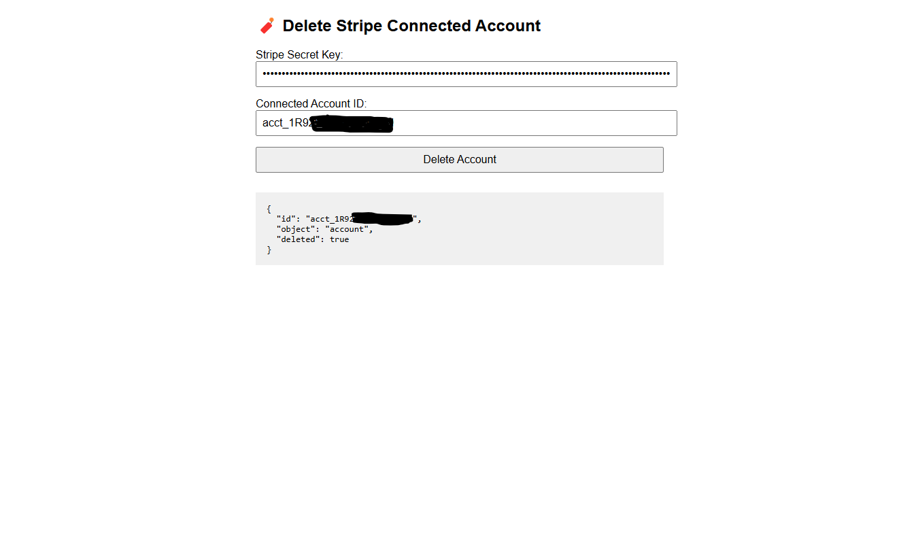

# delete-stripe-connected-account
  Delete Stripe Connected Account

  It is a script that helps you delete connected accounts from the stripe list.
Connected accounts that you no longer need or have been Not completely registered, now you can delete them with this code html by entering only the stripe Secret Key and Connected account ID.

Run the code to http Web mod http://localhost/connected-account-stripe-del/index.html

GO to 
https://ghepes.github.io/delete-stripe-connected-account/connected-account-stripe-del/index.html

LG
Iulian
